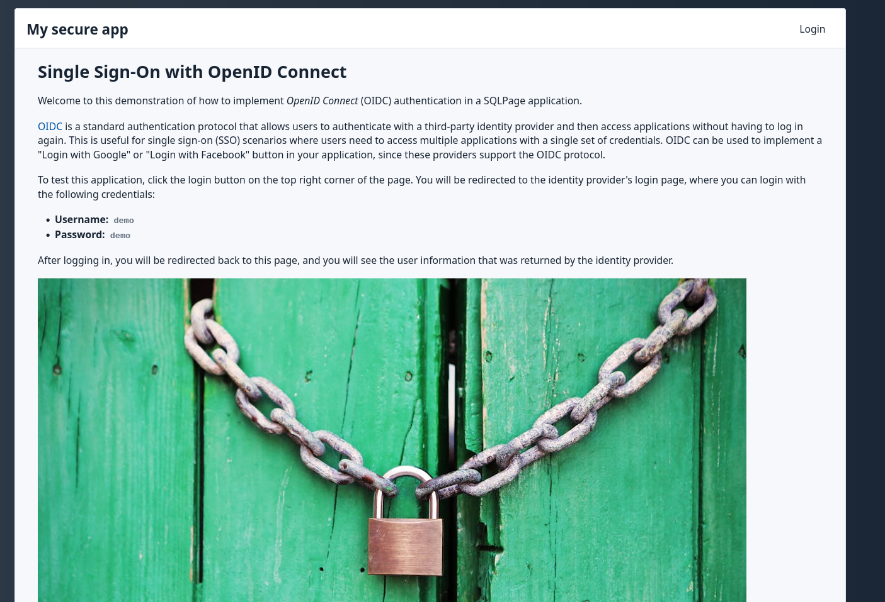
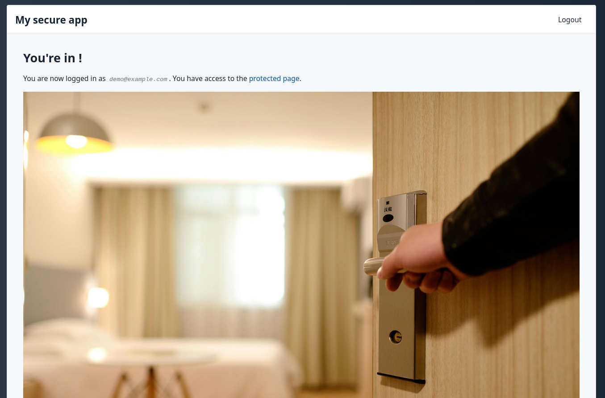
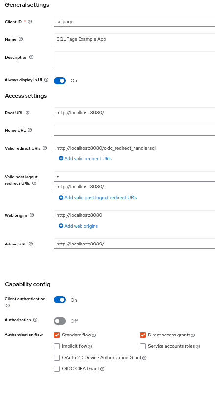

# SQLPage OIDC Implementation Demo

This project demonstrates how to implement OpenID Connect (OIDC) authentication in a SQLPage application.

OIDC is an authentication protocol that allows users to authenticate with a third-party identity provider and then access applications without having to log in again. This is useful for single sign-on (SSO) scenarios where users need to access multiple applications with a single set of credentials.
OIDC can be used to implement a "Login with Google" or "Login with Facebook" button in your application, since these providers support the OIDC protocol.

SQLPage currently doesn't have a native OIDC implementation, but you can implement OIDC authentication in your SQLPage yourself. This project provides a basic implementation of OIDC authentication in a SQLPage application, using [Keycloak](https://www.keycloak.org/) as the OIDC provider.


## Screenshots

| Home Page | Login Page | User Info |
| --- | --- | --- |
|  |  |  |

## Running the Demo

To run the demo, you just need docker and docker-compose installed on your machine. Then, run the following commands:

```bash
docker-compose up
```

This will start a Keycloak server and a SQLPage server. You can access the SQLPage application at http://localhost:8080.

The credentials for the demo are:
 - **Username: `demo`**
 - **Password: `demo`**

The credentials to the keycloak admin console accessible at http://localhost:8180 are `admin/admin`.

## Configuration

If you want to use this implementation in your own SQLPage application, 
with a different OIDC provider, here are the steps you need to follow:

1. Create an OIDC application in your OIDC provider (e.g., Keycloak). You will need to provide the following information:
 - Redirect URI: This is the URL of your SQLPage application, followed by `/oidc_redirect_handler.sql`. For example, `https://example.com/oidc_redirect_handler.sql`.
 - Client ID: This is a unique identifier for your application. You will need to provide this value to your SQLPage application as an environment variable.
 - Client type (`public` or `confidential`). For this implementation, you should use `confidential` (sometimes called `web application`, `server-side`, or `backend`).
 - Client secret: This is a secret key that is used to authenticate your application with the OIDC provider. You will need to provide this value to your SQLPage application as an environment variable.

2. You need to replace the following placeholders in the `oidc_redirect_handler.sql` file with your actual values:
- `http://keycloak:8181/realms/sqlpage_demo/protocol/openid-connect/`: Replace this with the base URL of your OIDC implementation.
- `http://localhost:8080/`: Replace this with the URL of your application.

You also need to set the following environment variables:

- `OIDC_CLIENT_ID`: The client ID of your OIDC application.
- `OIDC_CLIENT_SECRET`: The client secret of your OIDC application.

Here is a screenshot of the Keycloak configuration for the demo application:



## Overview

The main logic is contained in the `oidc_redirect_handler.sql` file. This script handles the OIDC redirect after the user has authenticated with the OIDC provider. It performs the following steps:

1. Checks if the `oauth_state` cookie matches the `state` parameter in the query string. This is a security measure to prevent CSRF attacks. If the states do not match, the user is redirected to the login page.

2. Exchanges the authorization code for an access token. This is done by making a POST request to the OIDC provider's token endpoint. The request includes the authorization code, the redirect URI, and the client ID and secret.

3. If the access token cannot be obtained, the user is redirected to the login page.

## References

- An accessible explanation of OIDC: https://annotate.dev/p/hello-world/learn-oauth-2-0-by-building-your-own-oauth-client-U2HaZNtvQojn4F
- [OpenID Connect](https://openid.net/connect/)
- [Authorization Code Flow](https://openid.net/specs/openid-connect-core-1_0.html#CodeFlowAuth)

